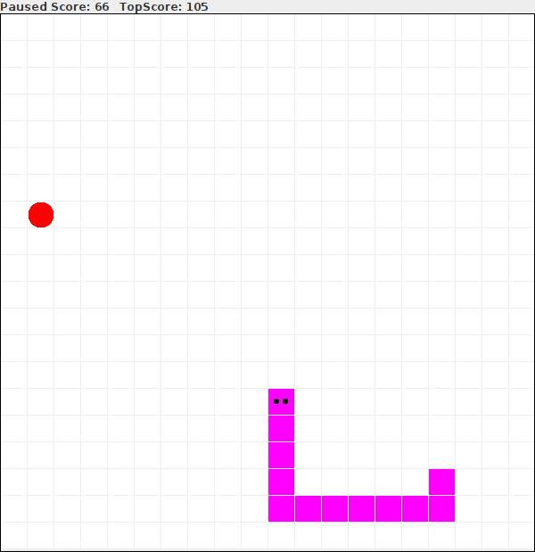

# Fruit Snake

I beg you snake, eat the red fruits, not yourself, please. ;-)





## Build an run the application (jar file)
```shell
$ make 
```

## Run the application (jar-file)
```shell
$ make run
```

Alternativ approach
```shell
$ java  -jar FruitSnake.jar
```

# Resources 
Red Apple Icon (Author: inipagi, Licence: CC BY 4.0, Link: https://icon-icons.com/icon/Apple-fruit/82499)


